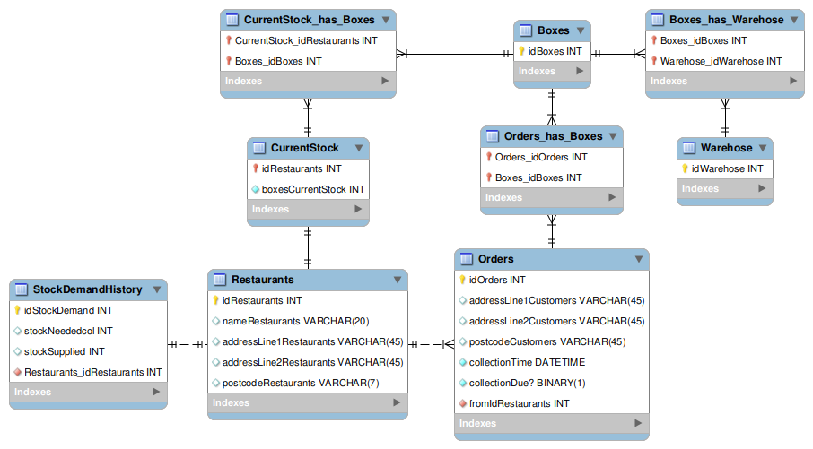
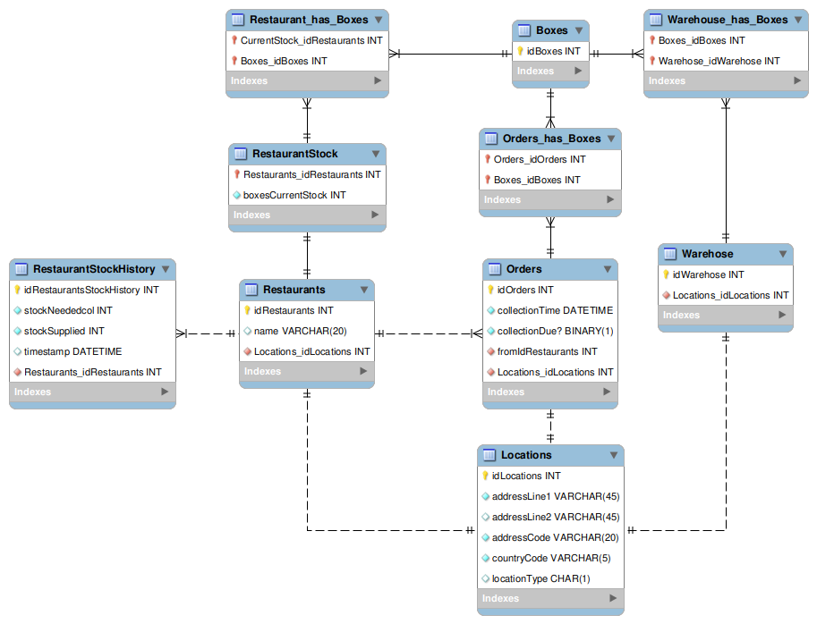

Outline
========

## Problem

Takeaway box recycling is non-existent, which is bad for everyone involved.

- Takeaways have to buy new boxes which is expensive. As business costs continue to rise this becomes a strain on resources.

- Throw-away boxes add to household waste, which also puts more strain on waste collection services.

- Many plastic boxes are not recycled and are thrown into landfill, which may enter marine ecosystems due to run-off **CITE**.

- Production of boxes needs energy which may be sourced from non-green energy supplies. Upfront production and then reusing would reduce solution.

## Description of Service

It would be good to use reusable boxes for takeaways that are simply returned at a person's door, as most are thrown out and not recycled or reused. The use and return of reusable boxes is the primary interest of operation, and ideally there should be slightly more boxes in circulation than is needed for supply. The system will take into account the trends in popularity of orders from a location and will calculate an appropriate amount to redistribute every day, plus ideally wants to keep a restaurant's stock above >10% of expected demand.

Most takeaways are bought in the evening **CITE** so it would be good to do collection in the morning after and return to a local centre for redistribution. The box warehouse is tasked with cleaning and redistributing the boxes. A stock of boxes should already be ready for redistribution that same morning. Since takeaways are mostly ordered online, it would be easy enough to store a list of houses to collect from. This list then creates a graph of location data and an algorithm determines the shortest path for multiple collectors. Restaurant's location for redistribution is mostly constant, although it will need to be updated as more businesses join or leave the service.

## Broad design aspects

Both the design of the digital products and the boxes should follow a modern and uniform design. The service should be *ubiquitous* - having as little user interaction as possible. Design should make it clear as to how to use and return the boxes.

Since this is project is in the domain of food, the main three colours that should be considered are red, orange and yellow **CITE**. These colours are known for there appeal to appetite for people.

\pagebreak

## Components

Exact technologies will be researched in due time, for now here are the important moving parts that will need to be integrated.

### Database

The database is where all the information regarding location and stock is stored.

- Table of restaurants w/ location and stock of boxes.

- Table of average weekly demand for a restaurant, per specific day of the week.

- Table of collection points which are removed once collected, along with the expected number of boxes.

- Table of warehouses w/ location and stock

### Web service

The system should be effectively autonomous with very little need for human interaction. However, one crucial aspect of operation is data regarding order location and demand for boxes. The restaurant must specify where the boxes are sent and how many are sent for an order. Hopefully this system can eventually be integrated into a food ordering service which would reduce the need for interaction considerably.

Collection routes for collectors is generated and released the following morning, so that collection can begin. This will also require user interface for directions.

As an additional feature, it would be nice to get customer input whether they would like to opt out of the service and whether they would like to defer collection for a day if they want to keep leftovers for example.

\pagebreak

## Business Domain

There are two main algorithms that run the service. Restaurant demand calculation and collection route planning.
  
### Restaurant Demand Calculation

Demand varies in a weekly cycle **CITE**, and may spike due to specific events in the year. This depends on the restaurant in question, so it becomes crucial to get some insight into how much is needed at a given time.

Roughly the calculation for restocking should be the difference between the projected stock for the following day (with a 10% buffer) and the remaining stock from the previous day. If there are already enough boxes on location 

$$
\text{replaced} = \begin{cases} 0 & \text{current} > \text{projected} \times 110 \% \\ \text{projected} \times 110 \% - \text{current} & \text{current} \le \text{projected} \times 110 \% \end{cases}
$$

### Collection Route Planning

After each day there exists a table of locations in the database, from which boxes will need to be collected the following morning. The algorithm will create the shortest paths for multiple collectors using a travelling salesman-like algorithm for multiple simultaneous actors.

\pagebreak

## Technologies

There are a huge variety of web services available for developing an online service. A functional programming language is preferable as it is easier to develop robust business logic.

The three main languages and frameworks considered:

- Elixir, using Phoenix Liveview

- Scala, using Play Framework/Akka HTTP

- Python, using Django/Flask
 
### Table showing differences between the languages
 
| Aspect | Elixir `` | Scala `` | Python `` |
| ------ | ---------- | --------- | ---------- |
| Paradigm | Functional, concurrent, distributed. | Hybrid: functional and object-oriented. | Multi-paradigm: imperative, functional, object-oriented. |
| Performance | High concurrency, low latency (BEAM VM). | High performance (JVM-based). | Moderate; heavily depends on libraries and extensions (e.g., NumPy). |
| Concurrency | Best-in-class concurrency using lightweight processes. | Concurrency via Akka (complex but powerful). | Limited; better for single-threaded tasks or via asyncio. |
| Ecosystem | Young, focused ecosystem. Ideal for real-time systems. | Mature JVM ecosystem; versatile but complex. | Extremely broad ecosystem, libraries for almost everything. |
| Tooling | Excellent debugging and monitoring tools (Observer, Logger). elixir-ls is fully featured. | Great build tools like SBT and IntelliJ support. Metals doesn't include autocomplete. | Rich tools (pip, virtualenv, Jupyter for prototyping). |
| My experience | Currently learning | No experience, but knowledge of similar language Haskell | Strong experience |

\pagebreak

### Table showing different metrics of the three languages' full stack frameworks

| Aspect | Elixir `` | Scala `` | Python `` |
| ------ | ---------- | --------- | ---------- |
| Frameworks | Phoenix (Backend), LiveView | Play Framework, Akka HTTP | Django, Flask (Backend), FastAPI |
| Frontend | LiveView enables server-side rendering without JS for dynamic UI. | Uses standard JS frameworks (React, Angular). | Tight integration with JS frameworks like React, Vue. |
| Scalability | Exceptional for real-time apps and fault tolerance. | Strong for distributed, scalable applications. | Scales reasonably with frameworks like Django. |
| Ease of Use | Moderate; requires understanding of functional programming and OTP. | Steeper learning curve; strong typing and functional paradigm. | Easiest to learn; widely understood syntax. |

### Table showing different metrics for databasing options

| Aspect | Elixir `` | Scala `` | Python `` |
| ------ | ---------- | --------- | ---------- |
| Database Manager | Ecto | Slick/Doobie | SQLAlchemy/Django ORM |
| Query DSL | Functional, type-safe | Functional, type-safe | High-level (Django) or flexible (SQLAlchemy). |
| Schema Definition | Explicit schemas | Case classes (Slick), manual in Doobie. | Python classes or declarative models. |
| Data Validation | Changesets | Manual | Manual or via forms in Django. |
| Migrations | Built-in | External tools (Flyway) | Built-in (Django ORM, Alembic for SQLAlchemy). |

\pagebreak

### Choice: Elixir ``

The main draw for this project is for an enjoyable development experience. The project development tool *mix* is very handy from my experience and programming in Elixir feels more rewarding than having to learn Scala as a new language. Scala might have the performance edge for single threaded code, but BEAM has concurrency covered. Python has poor performance for both, so I'm trading development time in for runtime performance. The only thing that bothers me is that I prefer strongly typed languages, but I think Elixir is better suited for this project in every other way. Concurrency is a hard thing to program, so it's better if I stick to a language that makes it more accessible, it's not easy in Python and I suspect it wouldn't be in Scala either.

So the stack will be:
 
- Language: Elixir

- Package Manager: Hex

- Build Tool: Mix

- Web Framework: Phoenix LiveView

- Database: MySQL

- Database migration: Ecto, MyXQL

## Next Steps

Model the database Using EER

Create a service diagram

Project setup

Researching mapping technology for collection frontend

[`󰌷` How do you integrate Google Maps API with Phoenix LiveView](https://medium.com/elemental-elixir/how-do-you-integrate-google-maps-api-with-phoenix-liveview-818366c63721)

\pagebreak

EER Diagram
============

First draft shows restaurants having a history, multiple boxes and multiple orders. *Current Stock* is used to count the number of boxes within *CurrentStock_has_Boxes*. *StockDemandHistory* records the number of boxes on premesis and the total needed per day for individual restaurants. Each order is given a record with a collection date (set to the morning after). When the current time exceeds the date, the program will update the *collectionDue?* boolean so that the boxes orders can be collected. Once collected the order should be removed from *Orders*, along with address details.

Boxes are also tracked by ID and moved between all of the *\_has\_* tables when ownership of the box changes. This includes from restaurants to orders, and then back to the warehouse.

\pagebreak

The improved version of the database extracts location data so that it can be stored more easily. Warehouses now have a location as well, which will improve collection pathfinding.

Another change is that *StockDemandHistory* has been renamed to *RestaurantStockHistory* (amongst other renamings), and now has a timestamp and a $1:n$ relationship with restaurants.
